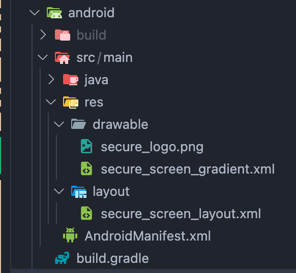

# bg-secure

An Expo React Native module(that works!) for securing your app's content from screenshots and app switcher previews.
Tested on sdk 50,51,52 so far working for ios and android.

## Features

- **Screenshot Protection**:

    - Android: Completely blocks screenshots
    - iOS: Allows customizing the screenshot content with a specified image

- **App Switcher Security**:
    - Both iOS and Android: Protects sensitive content from appearing in the app switcher
    - Android: Uses a predefined image from the module's resources
    - iOS: Customizable using the SecureView component

## Installation

### For Expo Projects

```bash
npx expo install bg-secure
```

### For bare React Native projects

```bash
npm install bg-secure
# or
yarn add bg-secure
```

Then run:

```bash
npx pod-install
```

## Usage

### Basic Setup

```javascript
import BgSecure, { SecureOverlay } from 'bg-secure';
```

### Enabling Secure Mode

```javascript
// @ts-ignore
import image from '@/assets/image.png';
// For iOS - with custom screenshot image
const handleEnable = () => {
	if (Platform.OS === 'ios') {
		const resolvedImage = Image.resolveAssetSource(yourImage);
		BgSecure.enableSecureView(resolvedImage.uri.replace('file://', ''));
	} else {
		// For Android - blocks screenshots completely
		BgSecure.enableSecureView();
	}
};
```

### Using SecureOverlay Component to customize the app switcher view (iOS only)

The SecureOverlay component provides a way to customize the app switcher view:

```javascript
<SecureOverlay>
	{/* Your secure screen content. This will show up in the app switcher for iOS */}
	<LinearGradient
		colors={['#003D65', '#007FAD']}
		style={{
			flex: 1,
			justifyContent: 'center',
			alignItems: 'center',
		}}
		start={{ x: 0, y: 0 }}
		end={{ x: 0, y: 1 }}
	>
		{image ? (
			<Image
				source={image}
				style={{ flex: 1, width: '80%' }}
				resizeMode="contain"
			/>
		) : null}
	</LinearGradient>
</SecureOverlay>
```

### Platform-Specific Details

#### iOS

- Screenshot Protection: Allows customization of screenshot content
- App Switcher: Uses SecureView configuration as shown in usage example

#### Android

- Screenshot Protection: Completely blocks screenshots
- App Switcher: Uses predefined images from:
  
    - `android/src/main/res/drawable/secure_screen_gradient.xml`
    - `android/src/main/res/drawable/secure_logo.png`
    - `android/src/main/res/layout/secure_screen_layout.xml`

## Contributing

Contributions are welcome! Please refer to guidelines described in the [contributing guide](https://github.com/expo/expo#contributing).
